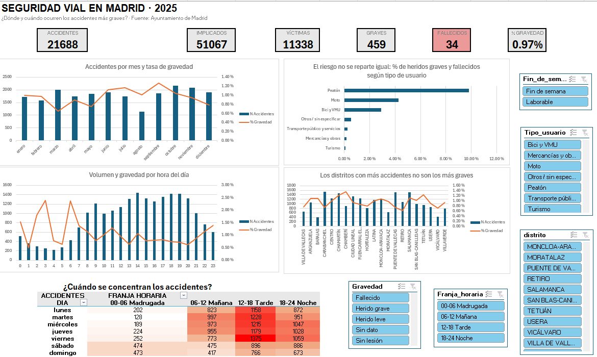

# 🚦 Accidentes de tráfico en Madrid 2025: ¿dónde y cuándo ocurren los más graves?

Análisis exploratorio y dashboard en Excel sobre los 21.688 accidentes de tráfico registrados por la
Policía Municipal de Madrid durante 2025.

## 📖 Descripción

Este proyecto analiza los accidentes de tráfico de la ciudad de Madrid en 2025 desde la perspectiva de
la **seguridad vial**: no solo *cuántos* accidentes hay, sino **dónde, cuándo y a quién** le ocurren los
más graves.

La diferencia entre ambas preguntas es el hilo conductor del análisis: el distrito con más accidentes no
tiene por qué ser el más peligroso, y la hora con más siniestros no es la que más víctimas graves deja.

El trabajo cubre el ciclo completo: obtención de los datos originales, transformación y limpieza con
**Power Query**, análisis descriptivo con **modelo de datos, medidas DAX y tablas dinámicas**, y un
**dashboard interactivo**, todo dentro de un único libro de Excel.

## 🗂 Estructura del proyecto

```
├── data/
│   ├── accidentes_trafico_madrid_2025.csv   # Datos originales sin modificar (9,4 MB)
│   └── FUENTE.md                            # Origen, licencia y detalles del dataset
├── images/
│   └── dashboard.png                        # Vista general del dashboard
├── accidentes_madrid_2025.xlsx              # Libro con todo el proceso
└── README.md                                # Este archivo
```

Hojas del libro de Excel:

| Hoja | Contenido |
|---|---|
| `Dashboard` | KPIs, 4 gráficos, mapa de calor y 5 segmentadores |
| `Informe` | Resumen ejecutivo del análisis |
| `Análisis` | 11 tablas dinámicas con el análisis descriptivo |
| `Datos_limpios` | Tabla resultante de Power Query: 51.067 filas × 34 columnas |

## 📊 Los datos

| | |
|---|---|
| **Fuente** | [Portal de Datos Abiertos del Ayuntamiento de Madrid](https://datos.madrid.es/dataset/300228-0-accidentes-trafico-detalle) |
| **Origen** | Dirección General de la Policía Municipal |
| **Periodo** | Año 2025 completo |
| **Volumen** | 51.067 registros · 19 columnas originales |
| **Licencia** | CC BY 4.0 — © Ayuntamiento de Madrid |

⚠️ **Clave para interpretar los datos:** cada fila **no es un accidente, sino una persona implicada**
en él. Los 51.067 registros corresponden a **21.688 accidentes** (2,4 personas implicadas de media).
La columna `num_expediente` es la que agrupa a los implicados de un mismo siniestro. Por eso los
accidentes se cuentan con un **recuento distinto** sobre el modelo de datos, no con un recuento normal.

## 🛠 Herramientas

- **Microsoft Excel**: Power Query, modelo de datos (Power Pivot), medidas DAX, tablas dinámicas,
  gráficos dinámicos, formato condicional y segmentadores.
- No se ha usado ningún lenguaje de programación: todo el proceso es reproducible desde el propio libro.

> Para reproducirlo: abrir el libro, ir a `Datos → Consultas y conexiones → Accidentes → Editar` y
> actualizar la ruta del paso `Origen` a la ubicación local del CSV. Después, `Datos → Actualizar todo`.

## 🧹 Transformación y limpieza

Todo el proceso está registrado como pasos de Power Query en la consulta `Accidentes`, por lo que es
**reproducible y auditable**: basta con actualizar la consulta para reconstruir la tabla limpia desde el
CSV original.

1. **Importación** del CSV (UTF-8, delimitador `;`) respetando las comillas de texto.
2. **Tipado manual** de las columnas, en lugar del automático.
3. **Normalización de categorías**: unificación de los valores desconocidos bajo la etiqueta `Sin dato`,
   corrección de `LLuvia intensa` y unificación de las dos variantes de `Peatón`.
4. **Tratamiento de huecos**: `positiva_alcohol` y `positiva_droga` solo marcaban los positivos, así que
   los vacíos pasaron a `N`.
5. **16 columnas calculadas** para el análisis: `Gravedad`, `Tipo_usuario`, `Grupo_vehiculo`,
   `Franja_horaria`, `Dia_nombre`, `Es_vulnerable`, `Es_victima`, `Edad_orden`, `Es_interseccion`, etc.

### Decisiones de limpieza que merecen explicación

- **No se eliminaron los duplicados.** El dataset contiene 2.065 filas exactamente idénticas, pero **no
  son errores**: son personas distintas con los mismos atributos implicadas en el mismo accidente (por
  ejemplo, dos pasajeros del mismo tramo de edad y sexo en un mismo vehículo). Como no existe un
  identificador de persona, eliminarlas habría supuesto **perder víctimas reales**.
- **La columna `numero` se mantuvo como texto.** El tipado automático de Excel la convertía a número y
  dejaba como error las 331 filas con códigos de vía como `+00500E` o `12RE09`.
- **Los vacíos de `lesividad` no se imputaron.** El 44,3% de los registros no tiene dato de lesividad y
  se ha mantenido como categoría propia `Sin dato`, en lugar de asumir que significan "sin lesión".

### Errores detectados durante el proceso

Dos de ellos no generaban ningún mensaje de error y solo se detectaron **cuadrando los totales
esperados con los obtenidos**:

| Problema | Impacto | Solución |
|---|---|---|
| `Text.Contains` distingue mayúsculas: `"Camión"` no capturaba `Tractocamión` | 242 filas mal clasificadas de forma silenciosa | Sustituido por listas de valores exactos con `List.Contains` |
| `QuoteStyle.None` ignoraba las comillas del CSV | 5 filas con `;` dentro del campo `localizacion` se partían en 20 campos y desplazaban todas sus columnas | Cambiado a `QuoteStyle.Csv` |
| Los huecos eran texto vacío `""`, no `null` | Los reemplazos de nulos no surtían efecto | Paso `Table.TransformColumns` que cubre `null`, `""` y espacios |

## 📈 Análisis: medidas del modelo

La métrica central del proyecto es la **tasa de gravedad**, que permite comparar categorías de tamaños
muy distintos:

```dax
Graves y fallecidos = SUM(Accidentes[Es_grave_o_fallecido])
% Gravedad          = DIVIDE([Graves y fallecidos], [N Personas])
```

Sin ella, el análisis se quedaría en un ranking de volumen, que lleva a conclusiones equivocadas.

## 🖥 Dashboard



Incluye seis KPIs, cuatro gráficos (evolución mensual, tipo de usuario, hora del día y distritos), un
mapa de calor de día × franja horaria y cinco segmentadores (distrito, tipo de usuario, gravedad,
franja horaria y tipo de día) conectados a todas las tablas dinámicas.

## 📊 Resultados y conclusiones

### 1. El riesgo se concentra en los usuarios vulnerables

Peatones, motos y bicis/VMU son el **17,5% de los implicados**, pero acumulan el **91,3% de los heridos
graves** y el **88% de los fallecidos**.

| Tipo de usuario | Implicados | Graves | Fallecidos | % Gravedad |
|---|---|---|---|---|
| Peatón | 1.681 | 165 | 13 | **9,82%** |
| Moto | 5.478 | 233 | 14 | 4,25% |
| Bici y VMU | 1.790 | 52 | 3 | 2,91% |
| Transporte público | 1.637 | 4 | 0 | 0,24% |
| Mercancías y obras | 4.976 | 8 | 0 | 0,16% |
| Turismo | 34.928 | 28 | 4 | **0,08%** |

Un peatón implicado tiene **120 veces más probabilidad** de acabar herido grave o fallecido que un
ocupante de turismo. **13 de los 34 fallecidos del año iban a pie**, siendo solo el 3,3% de los implicados.

### 2. Volumen y gravedad van en direcciones opuestas

- La **tarde** concentra el 36% de los accidentes con una gravedad del 0,85%; la **madrugada**, con menos
  de la cuarta parte de siniestros, alcanza el **1,28%**.
- Las horas más graves son las **03:00 (2,40%)** y las **06:00 (2,37%)**, justo las de menor volumen. El
  pico de accidentes son las 14:00 (1.442), con una gravedad de solo el 1,07%.
- Sábado y domingo de madrugada registran 474 y 473 accidentes, frente a los 128-252 de las madrugadas
  de diario: **casi el triple**. El ocio nocturno se dibuja con nitidez en el mapa de calor.

### 3. El distrito con más accidentes no es el más peligroso

| Distrito | Accidentes | % Gravedad |
|---|---|---|
| Carabanchel | 1.536 (1º en volumen) | 0,74% (18º en gravedad) |
| Chamartín | 1.468 | 1,22% |
| Chamberí | 895 | **1,36%** (1º en gravedad) |
| Retiro | 1.074 | **0,61%** (el más bajo) |

Carabanchel y Chamartín tienen un volumen parecido, pero **Chamartín registra un 54% más de heridos
graves**. Un plan basado solo en el número de accidentes dirigiría los recursos al distrito equivocado.

Además, el **44,5% de los accidentes ocurre en intersecciones**, con mayor gravedad que en tramo
(1,06% frente a 0,89%), y **el 42,9% de los atropellos sucede en un cruce**.

### 4. Otros factores relevantes

- **Atropello (5,26%)** y **caída (2,29%)** son los tipos de accidente más lesivos; el alcance, el
  segundo más frecuente, es el menos grave (0,35%).
- **Drogas:** solo 134 positivos, pero con un **7,46% de gravedad**, casi 8 veces la media.
- **Alcohol:** 1.338 positivos (2,6%), con un 1,42% de gravedad frente al 0,95% de los negativos.
- **Mayores de 74 años:** la tasa más alta por edad, **3,95%**, con 8 fallecidos de 1.267 implicados.
- **Meteorología:** con cielo despejado la gravedad es del 1,15% y con lluvia intensa del 0,35%. No
  significa que llover sea más seguro: es un **sesgo de exposición**, ya que con lluvia hay menos tráfico
  y se circula más despacio, y el buen tiempo es la condición habitual en Madrid.

### Recomendaciones

1. **Priorizar la protección del peatón en intersecciones**: pasos elevados, ampliación de aceras,
   visibilidad y tiempos semafóricos.
2. **Reforzar la vigilancia nocturna en fin de semana**, cuando coinciden el triple de volumen y las
   mayores tasas de gravedad.
3. **Usar la tasa de gravedad, y no el número de accidentes**, como criterio para decidir dónde actuar.
4. **Atender a motoristas y usuarios de VMU**: el 14% de los implicados y el 58% de los heridos graves.

### ⚠️ Limitaciones

1. **El 44,3% de los registros no tiene dato de lesividad**, por lo que las tasas calculadas son
   conservadoras: la gravedad real podría ser mayor.
2. **No hay datos de exposición** (tráfico, desplazamientos o kilómetros recorridos), así que no puede
   calcularse el riesgo por trayecto, solo por persona implicada.
3. **Un solo año**: no permite distinguir tendencia de fluctuación puntual.
4. **Solo accidentes atendidos por la Policía Municipal**; los siniestros leves sin parte no aparecen.
5. **Sin desagregación por barrio**, solo por distrito.

## 🔄 Próximos pasos

- Incorporar los años 2019-2024 para analizar la evolución y validar si los patrones se repiten.
- Cruzar con los datos de aforo de tráfico del Ayuntamiento para calcular el riesgo por exposición y no
  solo por implicado.
- Geolocalizar los accidentes a partir de las coordenadas UTM para identificar puntos negros concretos,
  más allá del distrito.
- Analizar la tendencia de los VMU, cuyo uso crece y cuyo marco normativo ha cambiado en los últimos años.

## 🤝 Contribuciones

Este es un proyecto formativo personal. Cualquier sugerencia de mejora es bienvenida a través de una
issue o un pull request.

## ✒️ Autor

- Enrique Navarro — [@enriquenavarroansorena](https://github.com/enriquenavarroansorena)

Datos: © Ayuntamiento de Madrid, bajo licencia [CC BY 4.0](https://creativecommons.org/licenses/by/4.0/).
